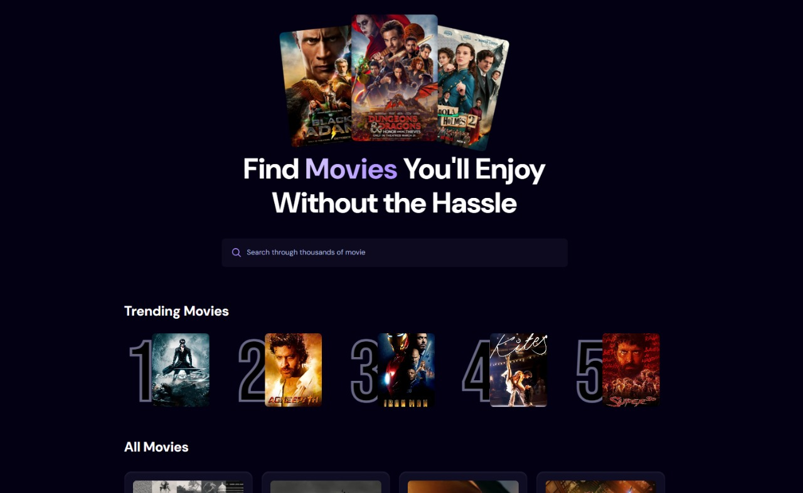
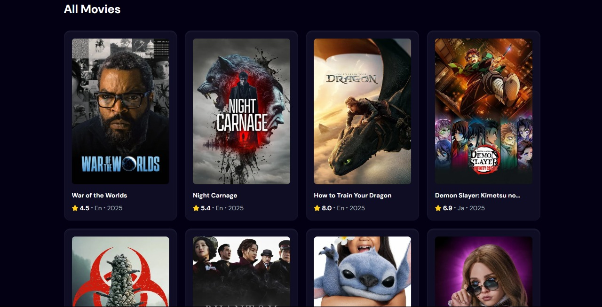

# MovieTrendz

MovieTrendz is a single-page web application that allows users to explore movies, view trending films, and search for their favorite titles. It fetches movie data from the TMDB API and uses an Appwrite database to track search trends, dynamically displaying the most-searched movies in a trending list.

## Features

- **Movie Cards**: Displays movies in a visually appealing card format, including the movie title, release date, poster, and rating.
- **Trending Movies**: Highlights the top 5 trending movies based on user searches stored in the Appwrite database or TMDB's trending API data.
- **Search Functionality**: Enables users to search for movies by title, with popular searches influencing the trending list in real-time.
- **Responsive Design**: Optimized for seamless use on both desktop and mobile devices.
- **Client-Side Data**: Fetches movie data from the TMDB API and stores search trends in an Appwrite database.

## Tech Stack

- **Frontend**: Vite, React, HTML, Tailwind CSS
- **API**: The Movie Database (TMDB) API for movie data
- **Database**: Appwrite for tracking and storing search trends
- **Deployment**: Hosted on Vercel

## Live Demo

Explore the live application at <a href="https://movietrendz.vercel.app/" target="_blank">Live link</a>

## Screenshots

  
  
_Caption: Homepage displaying movie cards and trending section._

## Installation

To run MovieTrendz locally, follow these steps:

1. **Clone the repository**:

   ```bash
   git clone https://github.com/your-username/movietrendz.git
   cd movietrendz
   ```

2. **Install dependencies**:

   ```bash
   npm install
   ```

3. **Set up environment variables**:
   Create a `.env` file in the root directory and add the following:

   ```env
   VITE_TMDB_API_KEY=your_tmdb_api_key
   VITE_APPWRITE_PROJECT_ID=your_appwrite_project_id
   VITE_APPWRITE_DATABASE_ID=your_appwrite_database_id
   VITE_APPWRITE_COLLECTION_ID=your_appwrite_collection_id
   ```

   - Obtain a TMDB API key from [https://www.themoviedb.org/](https://www.themoviedb.org/).
   - Set up an Appwrite project and note the project, database, and collection IDs.

4. **Run the development server**:

   ```bash
   npm run dev
   ```

5. Open `http://localhost:5173` in your browser to view the app.

## Usage

- **Browse Movies**: View a curated list of movies fetched from the TMDB API.
- **Search Movies**: Use the search bar to find specific movies by title.
- **Trending Section**: Check the top 5 trending movies, updated based on user searches.
- **Responsive Experience**: Access the app on any device for a consistent experience.

## API and Database

- **TMDB API**: Provides movie data, including titles, posters, release dates, and ratings. Register for an API key at [TMDB](https://www.themoviedb.org/).
- **Appwrite**: Tracks user search queries to generate a dynamic trending movies list. Configure your Appwrite instance to store and retrieve search data.

## Deployment

The application is deployed on Vercel. To deploy your own instance:

1. Push your code to a GitHub repository.
2. Connect the repository to Vercel and configure environment variables.
3. Deploy the app and access it via the provided URL.
